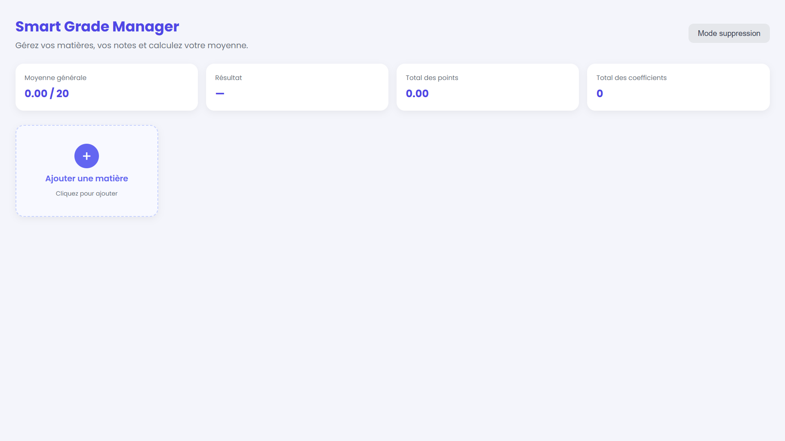

# smart-grade-manager_-group_8-_Web_project
This project is a website develloped in **HTML, CSS and pure JavaScript** (without framework) that BIT students will be able to access to calculate their average marks. It is the work of Group 8 as part of the web programming project assessed by Dr Nikiema.

## 📖 Description

Smart Grade Manager permet à un étudiant de saisir ses matières avec leurs notes et coefficients, puis de calculer automatiquement sa **moyenne pondérée** et d'obtenir son résultat (**Admis / Ajourné**) avec la mention correspondante.

Les données sont conservées dans le navigateur grâce à `localStorage` : elles restent disponibles même après la fermeture de la page.

---

## ✨ Fonctionnalités

| Fonctionnalité | Description |
|---|---|
| ➕ Ajouter une matière | Saisie du nom, de la note (0–20) et du coefficient via une fenêtre modale |
| 🗂️ Affichage en cartes | Chaque matière est présentée dans une carte, disposées en grille responsive |
| 🧮 Calcul automatique | Moyenne pondérée, total des points et total des coefficients, mis à jour en direct |
| 🏅 Résultat et mention | Ajourné, Passable, Assez Bien, Bien ou Très Bien selon la moyenne |
| 🗑️ Mode suppression | Sélection de plusieurs cartes par clic, puis suppression groupée |
| 💾 Sauvegarde locale | Les données persistent via `localStorage` |
| ✅ Validation des saisies | Messages d'erreur si le nom est vide ou si la note / le coefficient sont invalides |

---

## 📁 Structure du projet

```
Smart-Grade-Manager/
│
├── index.html              # Structure de la page (HTML)
│
├── css/
│   └── style.css           # Mise en forme et grille (CSS)
│
├── script/
│   └── script.js           # Logique de l'application (JavaScript)
│
├── Design/                 # Maquettes et références visuelles
│   ├── Design_1.png
│   ├── Design_2.png
│   ├── Design_3.png
│   ├── Design_4.png
│   └── Design_5.png
│
└── README.md               # Ce fichier
```

Le projet suit une **séparation des responsabilités** : la structure (`index.html`), la présentation (`css/`) et le comportement (`script/`) sont dans des fichiers et des dossiers distincts. C'est la bonne pratique standard en développement web : chaque membre de l'équipe peut travailler sur sa partie sans créer de conflit.

Les liens vers ces fichiers sont déclarés dans `index.html` :

```html
<!-- dans <head> -->
<link rel="stylesheet" href="css/style.css" />

<!-- juste avant </body> -->
<script src="script/script.js"></script>
```

### 🎨 Le dossier `Design/`

Ce dossier contient les **maquettes de référence** qui ont servi de base à l'interface. Elles ne sont pas utilisées par le code : ce sont des documents de conception, à consulter avant toute modification du CSS afin de rester cohérent avec la charte graphique.

| Fichier | Contenu |
|---|---|
| `Design_1.png` | *(à compléter — ex. : vue d'ensemble du tableau de bord)* |
| `Design_2.png` | *(à compléter)* |
| `Design_3.png` | *(à compléter)* |
| `Design_4.png` | *(à compléter)* |
| `Design_5.png` | *(à compléter)* |

> ℹ️ Remplace les descriptions ci-dessus par le rôle réel de chaque écran (page principale, fenêtre d'ajout, mode suppression, version mobile, etc.) — c'est ce que ton correcteur et ton équipe liront en premier.

Pour afficher une maquette directement dans ce README :

```markdown

```

---

## 🛠️ Technologies utilisées

- **HTML5** — structure sémantique de la page
- **CSS3** — mise en page avec **CSS Grid**, variables CSS (`:root`), design responsive
- **JavaScript (ES6)** — manipulation du DOM, gestion des événements, `localStorage`
- **Aucune dépendance externe** : ni framework, ni bibliothèque, ni installation

---

## 🚀 Installation et lancement

Aucune installation n'est nécessaire.

1. Télécharger ou cloner le projet :
   ```bash
   git clone <url-du-depot>
   cd Smart-Grade-Manager
   ```
2. Vérifier que l'arborescence est respectée : `index.html` à la racine, `style.css` dans `css/` et `script.js` dans `script/` (voir la section *Structure du projet*).
3. Ouvrir `index.html` dans un navigateur (double-clic, ou clic droit → *Ouvrir avec*).

> 💡 Avec VS Code, l'extension **Live Server** permet de recharger la page automatiquement à chaque modification.

**Navigateurs testés :** Chrome, Firefox, Edge (versions récentes).

---

## 📘 Guide d'utilisation

**Ajouter une matière**
Cliquer sur la carte « + Ajouter une matière », remplir le nom, la note et le coefficient, puis valider avec **Ajouter**.

**Consulter ses résultats**
La barre de résumé en haut de page affiche en permanence la moyenne générale, le résultat, le total des points et le total des coefficients.

**Supprimer des matières**
1. Cliquer sur **Mode suppression** — les cartes deviennent sélectionnables.
2. Cliquer sur les cartes à supprimer : elles se colorent en rouge.
3. Cliquer sur **Supprimer la sélection**.
4. Cliquer sur **Quitter le mode suppression** pour revenir à la normale.

---

## ⚙️ Fonctionnement du code

### Le principe central

Toutes les matières sont stockées dans **un seul tableau JavaScript** nommé `matieres`. Chaque matière est un objet :

```javascript
{ nom: "Mathématiques", note: 15.5, coefficient: 4, emoji: "🧮" }
```

La règle d'or du projet : **on ne modifie jamais l'affichage à la main.** On modifie le tableau, puis on appelle `afficherMatieres()`, qui redessine toutes les cartes à partir du tableau. Le tableau est la seule source de vérité.

### Les fonctions principales (`script/script.js`)

| Fonction | Rôle |
|---|---|
| `afficherMatieres()` | Efface puis recrée toutes les cartes à partir du tableau `matieres` |
| `mettreAJourResume()` | Calcule la moyenne pondérée et met à jour la barre de résumé |
| `obtenirMention()` | Renvoie le résultat textuel selon la moyenne (Ajourné, Bien, etc.) |
| `ouvrirModal()` / `fermerModal()` | Affichent et masquent la fenêtre d'ajout |
| `validerAjout()` | Vérifie les champs saisis, puis ajoute la matière au tableau |
| `basculerModeSuppression()` | Active ou désactive le mode suppression |
| `supprimerSelection()` | Retire du tableau les matières sélectionnées |
| `sauvegarder()` / `charger()` | Écrivent et lisent les données dans `localStorage` |

### La formule de la moyenne

```
Points d'une matière  =  note × coefficient

                          Σ (note × coefficient)
Moyenne pondérée     =  ───────────────────────
                            Σ (coefficients)
```

**Exemple :** Maths 15 (coef. 4) et Anglais 12 (coef. 2)
→ points = 60 + 24 = 84 ; coefficients = 6 ; moyenne = 84 ÷ 6 = **14.00 / 20** → *Admis – Bien*.

### Barème des mentions

| Moyenne | Résultat |
|---|---|
| < 10 | Ajourné |
| 10 – 11.99 | Admis – Passable |
| 12 – 13.99 | Admis – Assez Bien |
| 14 – 15.99 | Admis – Bien |
| ≥ 16 | Admis – Très Bien |

### Deux points techniques à retenir

- **La grille CSS** repose sur `grid-template-columns: repeat(auto-fill, minmax(240px, 1fr))` : le nombre de colonnes s'adapte tout seul à la largeur de l'écran, sans media query.
- **La suppression multiple** trie les index du plus grand au plus petit avant d'appeler `splice()`. Sans ce tri, supprimer un élément décalerait la position de tous les suivants et effacerait les mauvaises matières.

---

## 👥 Répartition du travail

| Membre | Partie | Fichiers concernés |
|---|---|---|
| *(Nom)* | Interface et intégration des maquettes | `index.html`, `css/style.css`, `Design/` |
| *(Nom)* | Ajout de matières et calcul de la moyenne | `script/script.js` |
| *(Nom)* | Mode suppression et sauvegarde locale | `script/script.js` |
| *(Nom)* | Tests, documentation et présentation | `README.md` |

---

## 🔮 Améliorations possibles

- Modifier une matière existante sans avoir à la supprimer
- Barre de recherche et filtre par semestre
- Répartition des matières entre Semestre 1 et Semestre 2
- Mode simulation : tester une note pour prévoir la moyenne finale
- Export des résultats en PDF
- Thème sombre

---

## 📄 Licence

Projet académique réalisé à des fins pédagogiques.