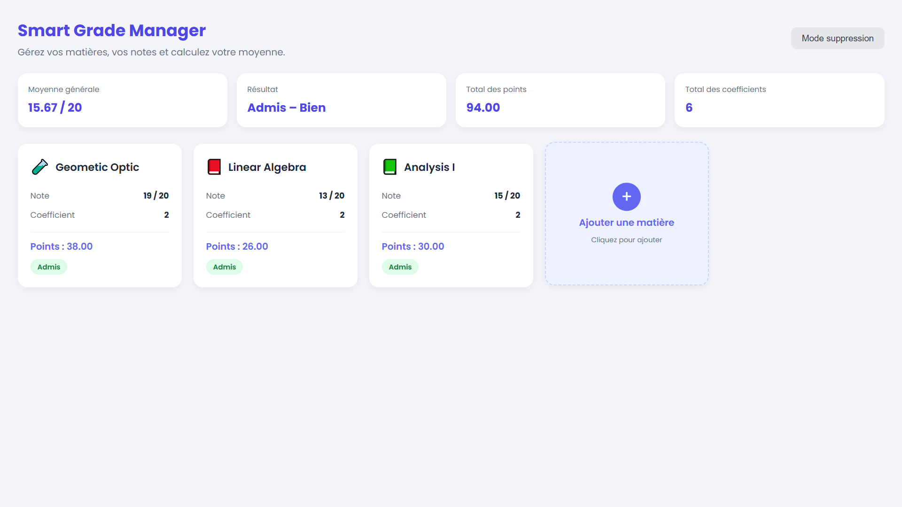
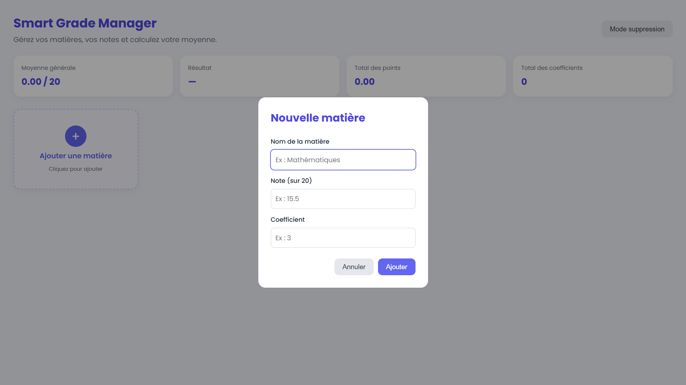
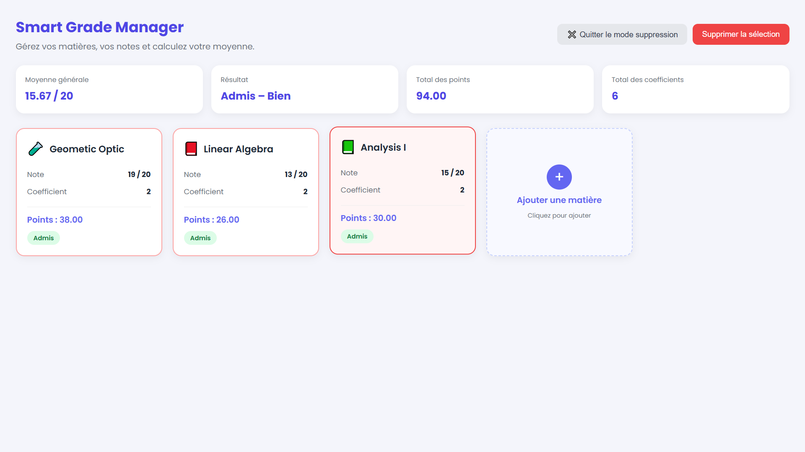

# Smart Grade Manager

> Application web de gestion et de calcul des moyennes étudiantes, développée en **HTML, CSS et JavaScript pur** — sans aucun framework ni bibliothèque externe.

Projet réalisé dans le cadre du module de **Web Programming** — 1ʳᵉ année Informatique.



---

## 📑 Sommaire

- [Description](#-description)
- [Fonctionnalités](#-fonctionnalités)
- [Aperçu de l'interface](#-aperçu-de-linterface)
- [Structure du projet](#-structure-du-projet)
- [Technologies utilisées](#️-technologies-utilisées)
- [Installation et lancement](#-installation-et-lancement)
- [Guide d'utilisation](#-guide-dutilisation)
- [Fonctionnement du code](#️-fonctionnement-du-code)
- [Défis rencontrés](#-défis-rencontrés)
- [Répartition du travail](#-répartition-du-travail)
- [Améliorations possibles](#-améliorations-possibles)

---

## 📖 Description

Smart Grade Manager permet à un étudiant de saisir ses matières avec leurs notes, coefficients et semestres, puis de calculer automatiquement sa **moyenne pondérée** et d'obtenir son résultat sous forme de **note alphabétique** (A+, A, B, C, D, F).

L'application fonctionne entièrement dans le navigateur, **sans serveur ni base de données**. Les données sont conservées grâce à `localStorage` : elles restent disponibles même après la fermeture de la page.

---

## ✨ Fonctionnalités

| | Fonctionnalité | Description |
|---|---|---|
| ➕ | **Ajouter une matière** | Saisie du nom, de la note (0–20), du coefficient et du semestre via une fenêtre modale |
| 🗂️ | **Affichage en cartes** | Chaque matière est présentée dans une carte, disposées en grille responsive |
| 🧮 | **Calcul automatique** | Moyenne pondérée, total des points et total des coefficients, mis à jour en direct |
| 🔤 | **Notation alphabétique** | Résultat exprimé de A+ à F, avec la mention correspondante et un code couleur |
| 📅 | **Gestion des semestres** | Chaque matière est rattachée au Semestre 1 ou 2 |
| 🔍 | **Recherche instantanée** | Filtrage des matières par nom, dès la première lettre tapée |
| 🎚️ | **Filtre par semestre** | Affichage de S1, S2 ou de l'ensemble — la moyenne s'adapte au semestre choisi |
| 🌙 | **Thème clair / sombre** | Bascule instantanée, avec mémorisation du choix |
| 🗑️ | **Mode suppression** | Sélection de plusieurs cartes par clic, puis suppression groupée |
| 💾 | **Sauvegarde locale** | Les matières et le thème persistent via `localStorage` |
| ✅ | **Validation des saisies** | Messages d'erreur si le nom est vide ou si la note / le coefficient sont invalides |

### Barème des mentions

| Moyenne | Note | Mention |
|:---:|:---:|---|
| 18 – 20 | **A+** | Excellent |
| 16 – 17.99 | **A** | Très Bien |
| 14 – 15.99 | **B** | Bien |
| 12 – 13.99 | **C** | Assez Bien |
| 10 – 11.99 | **D** | Passable |
| < 10 | **F** | Ajourné |

---

## 🖼️ Aperçu de l'interface

Le dossier `Design/` contient les captures d'écran de référence de l'application. Elles ne sont pas utilisées par le code : ce sont des documents de conception, à consulter avant toute modification du CSS afin de rester cohérent avec la charte graphique.

| Fichier | Écran illustré |
|---|---|
| `Design_1.png` | État initial — page vide avec la seule carte « Ajouter une matière » |
| `Design_2.png` | Mode suppression activé — apparition du bouton « Supprimer la sélection » |
| `Design_3.png` | Fenêtre modale d'ajout d'une nouvelle matière |
| `Design_4.png` | Vue principale — matières saisies et moyenne calculée |
| `Design_5.png` | Mode suppression — cartes sélectionnées en rouge |
| `Design_6.png` | Barre de recherche et filtre par semestre |
| `Design_7.png` | Thème sombre |
| `Design_8.png` | Notation alphabétique et code couleur |

<details>
<summary><b>Voir les captures d'écran</b></summary>

### Fenêtre d'ajout d'une matière


### Recherche et filtre par semestre


### Thème sombre


### Mode suppression


</details>

---

## 📁 Structure du projet

```
Smart-Grade-Manager/
│
├── index.html              # Structure de la page (HTML)
│
├── css/
│   └── style.css           # Mise en forme, grille et thèmes (CSS)
│
├── script/
│   └── script.js           # Logique de l'application (JavaScript)
│
├── Design/                 # Maquettes et captures de référence
│   ├── Design_1.png
│   ├── Design_2.png
│   ├── Design_3.png
│   ├── Design_4.png
│   ├── Design_5.png
│   ├── Design_6.png
│   ├── Design_7.png
│   └── Design_8.png
│
└── README.md               # Ce fichier
```

Le projet suit une **séparation des responsabilités** : la structure (`index.html`), la présentation (`css/`) et le comportement (`script/`) sont dans des fichiers et des dossiers distincts. C'est la bonne pratique standard en développement web — chaque membre de l'équipe peut travailler sur sa partie sans créer de conflit.

Les liens vers ces fichiers sont déclarés dans `index.html` :

```html
<!-- dans <head> -->
<link rel="stylesheet" href="css/style.css" />

<!-- juste avant </body> -->
<script src="script/script.js"></script>
```

---

## 🛠️ Technologies utilisées

| Technologie | Utilisation |
|---|---|
| **HTML5** | Structure sémantique de la page |
| **CSS3** | Mise en page avec **CSS Grid**, variables CSS (`:root`), thème sombre, design responsive |
| **JavaScript (ES6)** | Manipulation du DOM, gestion des événements, `localStorage` |

**Aucune dépendance externe** : ni framework, ni bibliothèque, ni installation, ni serveur.

---

## 🚀 Installation et lancement

Aucune installation n'est nécessaire.

1. Télécharger ou cloner le projet :
   ```bash
   git clone https://github.com/CAR-id13/smart-grade-manager_-group_8-_Web_project.git
   cd smart-grade-manager_-group_8-_Web_project
   ```
2. Vérifier que l'arborescence est respectée : `index.html` à la racine, `style.css` dans `css/`, `script.js` dans `script/`.
3. Ouvrir `index.html` dans un navigateur (double-clic, ou clic droit → *Ouvrir avec*).

> 💡 Avec VS Code, l'extension **Live Server** recharge la page automatiquement à chaque modification.

**Navigateurs testés :** Chrome, Firefox, Edge (versions récentes).

---

## 📘 Guide d'utilisation

**Ajouter une matière**
Cliquer sur la carte « + Ajouter une matière », remplir le nom, la note, le coefficient et le semestre, puis valider avec **Ajouter**.

**Rechercher et filtrer**
Taper dans la barre de recherche pour retrouver une matière par son nom. Le menu déroulant permet d'afficher uniquement le Semestre 1, le Semestre 2, ou l'ensemble. Le résumé affiche alors la moyenne du semestre sélectionné.

**Changer de thème**
Cliquer sur 🌙 pour passer en mode sombre, ☀️ pour revenir au mode clair. Le choix est mémorisé pour les visites suivantes.

**Supprimer des matières**
1. Cliquer sur **Mode suppression** — les cartes deviennent sélectionnables.
2. Cliquer sur les cartes à supprimer : elles se colorent en rouge.
3. Cliquer sur **Supprimer la sélection**.
4. Cliquer sur **Quitter le mode suppression** pour revenir à la normale.

---

## ⚙️ Fonctionnement du code

### Le principe central

Toutes les matières sont stockées dans **un seul tableau JavaScript** nommé `matieres`. Chaque matière est un objet :

```javascript
{ nom: "Mathématiques", note: 15.5, coefficient: 4, semestre: "S1", emoji: "🧮" }
```

La règle d'or du projet : **on ne modifie jamais l'affichage à la main.** On modifie le tableau, puis on appelle `afficherMatieres()`, qui redessine toutes les cartes à partir du tableau. Le tableau est la seule source de vérité — ce qui évite tout risque de désynchronisation entre les données et l'écran.

### Les fonctions principales (`script/script.js`)

| Fonction | Rôle |
|---|---|
| `afficherMatieres()` | Efface puis recrée les cartes, en appliquant les filtres actifs |
| `mettreAJourResume()` | Calcule la moyenne pondérée du semestre sélectionné |
| `obtenirLettre()` | Convertit une moyenne en note alphabétique (A+ à F) |
| `obtenirMention()` | Assemble la lettre et son libellé (ex. « B — Bien ») |
| `obtenirClasseCouleur()` | Renvoie la classe CSS colorant le résultat |
| `ouvrirModal()` / `fermerModal()` | Affichent et masquent la fenêtre d'ajout |
| `validerAjout()` | Vérifie les champs saisis, puis ajoute la matière au tableau |
| `basculerModeSuppression()` | Active ou désactive le mode suppression |
| `supprimerSelection()` | Retire du tableau les matières sélectionnées |
| `basculerTheme()` / `chargerTheme()` | Gèrent le thème clair / sombre et sa mémorisation |
| `sauvegarder()` / `charger()` | Écrivent et lisent les données dans `localStorage` |

### La formule de la moyenne

```
Points d'une matière  =  note × coefficient

                          Σ (note × coefficient)
Moyenne pondérée     =  ───────────────────────
                            Σ (coefficients)
```

**Exemple :** Maths 15 (coef. 4) et Anglais 12 (coef. 2)
→ points = 60 + 24 = 84 ; coefficients = 6 ; moyenne = 84 ÷ 6 = **14.00 / 20** → **B — Bien**.

### Trois points techniques notables

**La grille responsive** repose sur une seule déclaration, sans aucune media query :
```css
grid-template-columns: repeat(auto-fill, minmax(240px, 1fr));
```
Le nombre de colonnes s'adapte automatiquement à la largeur de l'écran.

**Le thème sombre** ne duplique aucune règle CSS. Toutes les couleurs sont des variables, redéfinies dans un seul bloc :
```css
:root        { --surface: #ffffff; --texte: #1f2937; }
body.sombre  { --surface: #1f2937; --texte: #f9fafb; }
```
Une seule classe ajoutée sur le `<body>` retourne l'ensemble du site.

**La notation alphabétique** teste les seuils du plus haut vers le plus bas. L'ordre est essentiel : un test `>= 10` placé en premier serait vrai pour 19 également, et toutes les moyennes recevraient un D.

---

## 🧩 Défis rencontrés

| Problème | Cause | Solution |
|---|---|---|
| **Les cartes se dupliquaient** à chaque ajout | On ajoutait au DOM sans effacer l'existant | Adoption du principe « on modifie le tableau, puis on redessine tout » |
| **La suppression multiple effaçait les mauvaises matières** | Chaque `splice()` décalait la position des éléments suivants | Tri des index du plus grand au plus petit avant suppression |
| **La suppression se trompait de cible quand un filtre était actif** | Les cartes étaient numérotées selon leur position à l'écran, pas dans le tableau | Conservation de l'index réel via `carte.dataset.index` |
| **`localStorage` refusait d'enregistrer le tableau** | Il ne stocke que du texte | `JSON.stringify()` à l'écriture, `JSON.parse()` à la lecture |
| **Les anciennes matières disparaissaient** après l'ajout des semestres | Les données déjà enregistrées n'avaient pas de propriété `semestre` | Migration automatique au chargement : semestre `S1` par défaut |
| **Texte noir sur fond noir** en thème sombre | Les champs de saisie gardaient leur couleur par défaut | Ajout de `color: var(--texte)` sur les `input` et `select` |
| **Page sans style** après réorganisation en dossiers | Les chemins pointaient encore vers la racine | Passage à `css/style.css` et `script/script.js` |

---

## 👥 Répartition du travail

| Membres | Partie | Fichiers concernés |
|---|---|---|
| OUEDRAOGO Melyka, DA Jeanine, KABORE Ezekiel | Interface et intégration des maquettes | `index.html`, `css/style.css`, `Design/` |
| SANOU Eunice, TRAORE Cheick | Ajout de matières et calcul de la moyenne | `script/script.js` |
| SANOU Eunice | Recherche, filtre par semestre et mode suppression | `script/script.js` |
| TRAORE Cheick, KABORE Ezekiel | Thème sombre, tests et documentation | `css/style.css`, `README.md` |

---

## 🔮 Améliorations possibles

- Modifier une matière existante sans avoir à la supprimer
- Mode simulation : tester une note hypothétique pour prévoir la moyenne finale
- Statistiques visuelles : graphique de répartition des notes
- Export des résultats en PDF
- Gestion de plusieurs profils étudiants
- Confirmation avant suppression définitive

---

## 📄 Licence

Projet académique réalisé à des fins pédagogiques.